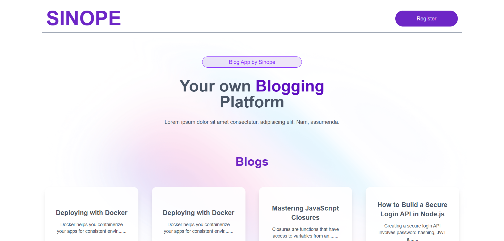
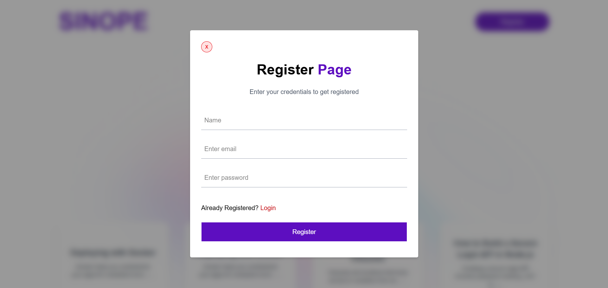
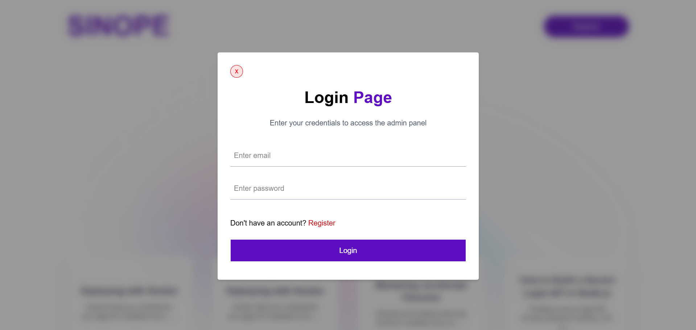
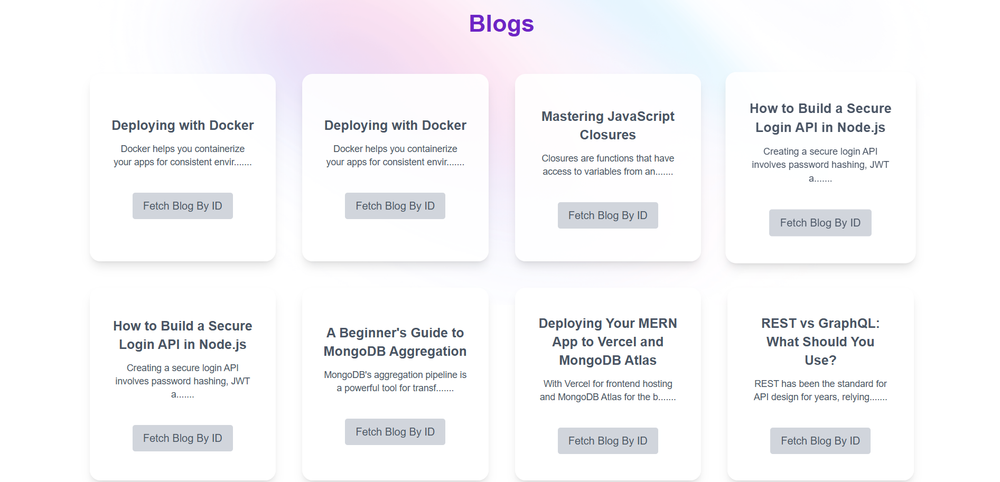
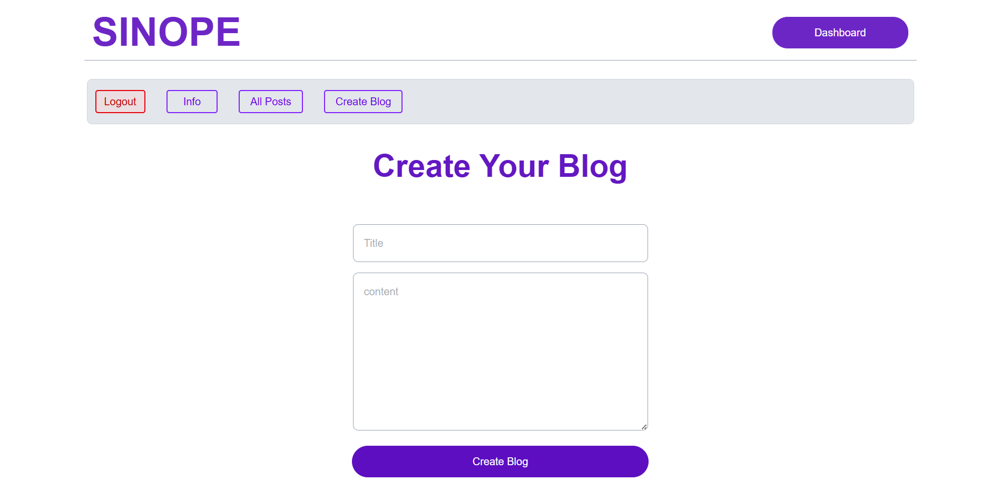

# Sinope Assignment

A full-stack blog application where users can register, log in, and create/update/delete blog posts. Built with **React (Vite)** on the frontend and **Express.js** on the backend. Hosted on **Vercel**.

---


## 🌐 Live Demo

👉 [https://sinope-assignment.vercel.app/](https://sinope-assignment.vercel.app/)

---


## 🔧 Setup Instructions

### 📁 1. Clone the Repository

```bash
git clone https://github.com/YOUR_USERNAME/Sinope-Assignment.git
cd Sinope-Assignment
```
### 📁 2. Client Setup (/client folder)

```bash
cd client
npm install
npm run dev
```

### 📁 3. Setting up ENV.(client/.env)

```bash
VITE_SERVER_URL=Your_backend_url

```

### 📁 4. Server Setup (/server folder)

```bash
cd server
npm install
node index.js
```

### 📁 5. Setting up ENV.(server/.env)

```bash
PORT=Your_PORT
MONGO_URL=your_mongodb_uri
JWT_SECRET=your_jwt_secret

```

---

## 📡 API Endpoints (Brief)

### 📁 1. Auth

POST /api/auth/register – Register a user
POST /api/auth/login – Log in a user
POST /api/auth/logout – Log out a user


### 📁 2. Blog

POST /api/blogs – Create a blog post
GET /api/blogs/getBlogs – Get all blog posts
GET /api/blogs/:id – Get a blog post by ID
PUT /api/blogs/update/:id – Update a blog post
DELETE /api/blogs/delete/:id – Delete a blog post
GET /api/blogs/getAuthorBlogs – Get blogs by the logged-in author

### 📁 3. User

GET /api/users/me – Get logged-in user details

---


## 📸 Screenshots

### 🏠 Home Page


### 🏠 Register


### 🏠 Login


### 🏠 All Blogs Fetch


### 🏠 Author Create Blog



---

## 🧑‍💻 Author
Rituraj Paul

---
